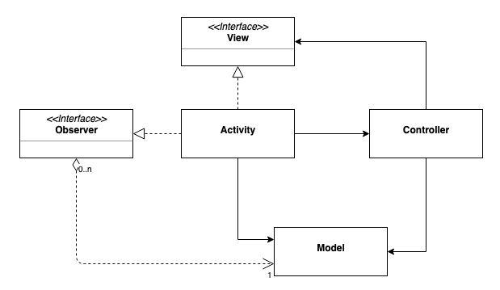

# android-mvc-sample
Sample project to show how to apply Model-View-Controller pattern to Android. 

This simple example is part of a Medium blog pos and it is supposed to be used as a reference and an example.

## Class Diagram

